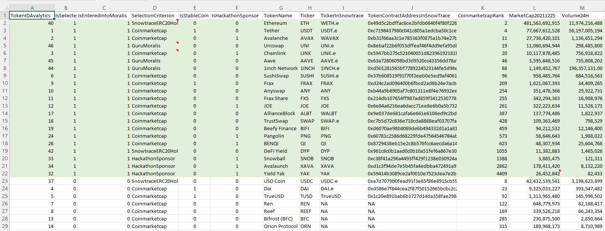
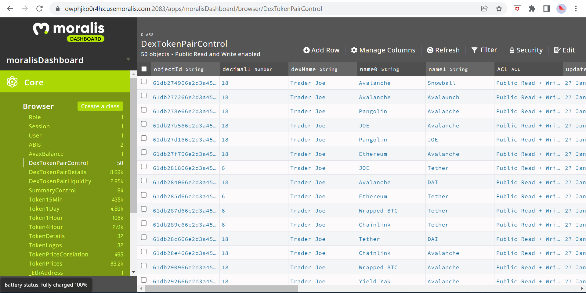

 

## Backend: Data under Moralis 

**Token Selection**

The data for Avalytics is stored in a Moralis Avalanche server. Older data of finer resolution is archived under AWS. Data at the `Staging Layer` is processed with Python under AWS and saved to the `Consumption Stage`, again under Moralis.

The tokens to be included in the dashboard were selected based on a procedure with multiple criteria. Firstly, a database of all major Avalanche tokens was constructed, to include top tokens as suggested by [SnowTrace](https://snowtrace.io) and [Avalanche Tokens under CoinMarketCap](https://coinmarketcap.com/view/avalanche-ecosystem/), as follows:

The tokens were shortlisted according to several criteria, including SnowTrace rank, CoinMarketCap rank, availability in Moralis, and whether the token's issuer is a sponsor of the Morali+Avalanche hackathon or not. Only some stable coins were selected as representative. Some tokens, such as [SushiSwap (SUSHI.e)](https://coinmarketcap.com/currencies/sushiswap/) and [SnowBall Finance (SNOB)](https://coinmarketcap.com/currencies/snowball-finance/), even though being significant, were later removed due to gaps in / problems with data collection.

**Data Tables Under the Moralis Server**

The following data tables were constructed under the Moralis server, as shown on the left-hand side of the following screenshot:

The data tables and the data in them can be summarized as follows:
- `DexTokenPairControl`: List of TraderJoe liquidity token pairs, for which data is collected
- `DexTokenPairDetails`: Details of of TraderJoe liquidity token pairs
- `DexTokenPairLiquidity`: Current data on TraderJoe liquidity token pairs, especially total value locked (TVL) and prices
- `SummaryControl`: Database of what type of data is collected for which token.
- `Token15Min`: Price, total supply, and market cap data for selected tokens, at a 15-minute time resolution. The formula used is (Market Cap) = (Price) x (Total Supply), where total supply excludes burned tokens.
- `Token1Day`: Price, total supply, and market cap data for selected tokens, at a 1-day time resolution. 
- `Token1Hour`: Price, total supply, and market cap data for selected tokens, at a 1-hour time resolution. 
- `Token4Hour`: Price, total supply, and market cap data for selected tokens, at a 4-hour time resolution. 
- `TokenDetails`: Details of the selected tokens, for which data is collected.
- `TokenLogos`: Logos of the selected tokens, for which data is collected.
- `TokenPriceCorrelation`: Correlation between selected tokens, based on daily prices over the last 4 weeks.
- `TokenPrices`: Token prices used in correlation calculations, for the last 4 weeks.

With the current data, due to fine-resolution data being moved to AWS, the Moralis server is far from being fully utilized, as shown in the following screenshot:

**Index**

1. [Background](Background.md)
2. [Unique Value Offerings](UniqueValueOfferings.md)
3. [Design Principles](DesignPrinciples.md)
4. [System Architecture](SystemArchitecture.md)
5. **Backend: Data under Moralis**
6. [Frontend: UI and Visual Analytics](Frontend.md)
7. [Technology/Tool Stack](TechnologyStack.md)
8. [Related Projects](RelatedProjects.md)
9. [Other Resources](OtherResources.md)
10. [Future Plans for Avalytics](FuturePlans.md)

<hline></hline>

[Back to Main GitHub Page](../README.md) | [Back to Documentation Index Page](Documentation.md)
