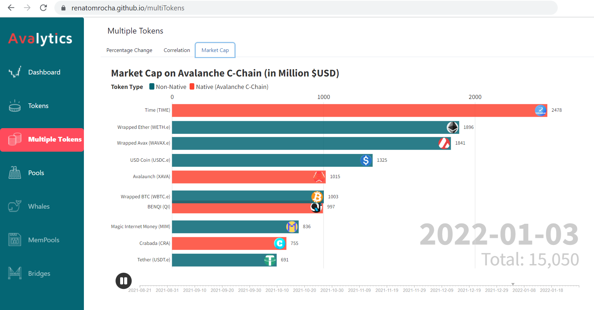
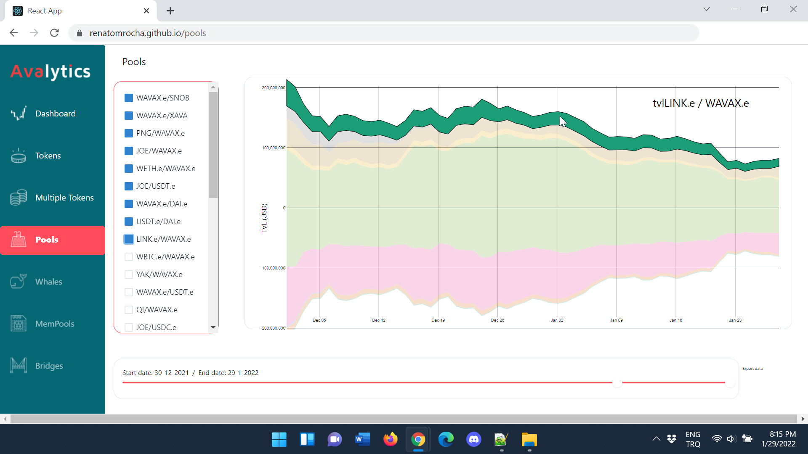

 

## Frontend: UI and Visual Analytics

This section describes the basic design of the user interface (UI) for the Avalytics app and the visual analytics methods used. 

There are four main screens/interfaces in the app:

- **Dashboard:** Basic information about top tokens on Avalanche C-Chain, including Market Cap (Top 5), top Gainers and Losers.  (under the `Dashboard` tab)
- **Tokens:** Price charts for individual tokens, both as line charts and [candlestick charts](https://www.coingecko.com/buzz/how-to-read-candlestick-charts). The charts can be filtered for selected time period and time resolution.  (under the `Tokens` tab)
- **Multiple Tokens:** Price changes and analytics for multiple tokens at once. Includes timeline visualization, correlation, and bar chart animation. (under the `Multiple Tokens` tab)
- **Pools:** Analytics for  [liquidity pools](https://traderjoexyz.com/pool) in the [TraderJoe](https://traderjoexyz.com) decentralized exchange (DEX). (under the `Pools` tab)

The main library to be used for visualizations are selected as [D3.js](https://d3js.org) and [Flourish Studio](https://flourish.studio/): 
- [D3 Visualization Gallery](https://observablehq.com/@d3/gallery) (JavaScript library for manipulating documents based on data)
- [Flourish Studio](https://flourish.studio/) (JavaScript library and platform for creating interactive charts, maps, and stories from data)

The following are sample code for the visualizations presented throughout the Avalytics app:

<ul>
  <li>Visualizations for the <b>Dashboard</b> tab</li>
      <ul>
        <li><a href="https://www.d3-graph-gallery.com/graph/line_basic.html" target="_blank">Line chart</a></li> (to display recent prices of important tokens)
        <li><a href="https://www.d3-graph-gallery.com/pie" target="_blank">Pie chart</a></li> (to display market caps of coins with highest market cap)
      </ul> 
  <li>Visualizations for the <b>Tokens</b> tab</li>
      <ul>
        <li><a href="https://www.d3-graph-gallery.com/graph/line_basic.html" target="_blank">Line chart</a></li> (to see the token prices over selected time period at a selected time resolution)
        <li><a href="https://observablehq.com/@d3/candlestick-chart" target="_blank">Candlestick chart</a></li> (to see the token prices over selected time period at a selected time resolution, as candlestick chart)
      </ul> 
  <li>Visualizations for the <b>Multiple Tokens</b> tab</li>
 <ul>
        <li><a href="https://observablehq.com/@d3/realtime-horizon-chart" target="_blank">Timeline visualization</a></li> (to analyze daily percentage price changes in selected tokens, where users can see the actual values by holding the cursor above the rectangles)
        <li><a href="https://plnkr.co/edit/RJk5vmROVAJGPHIPutVR?p=preview&preview" target="_blank">Correlogram</a></li> (to analyze correlation between tokens, calculated based on daily price changes for the last four week time period)
        <li><a href="https://app.flourish.studio/templates#template-bar-chart-race" target="_blank">Bar chart race</a></li> (to analyze change in market cap over time, where native tokens are shown with red and non-native (wrapped) tokens are shown in blue)
  </ul> 
  <li>Visualizations for the <b>Pools</b> tab</li>
     <ul>
     <li><a href="https://observablehq.com/@d3/streamgraph" target="_blank">Stacked area chart / Streamgraph</a></li> (to analyze changes over time in total value locked (TVL) in liquidity pools within the TraderJoe decentralized exchange (DEX)).
     </ul> 
</ul> 

## Avalytics Screenshots

**Index**

1. [Background](Background.md)
2. [Unique Value Offerings](UniqueValueOfferings.md)
3. [Design Principles](DesignPrinciples.md)
4. [System Architecture](SystemArchitecture.md)
5. [Backend: Data under Moralis](Backend.md)
6. **Frontend**
7. [Technology/Tool Stack](TechnologyStack.md)
8. [Related Projects](RelatedProjects.md)
9. [Other Resources](OtherResources.md)
10. [Future Plans for Avalytics](FuturePlans.md)

<hline></hline>

[Back to Main GitHub Page](../README.md) | [Back to Documentation Index Page](Documentation.md)
