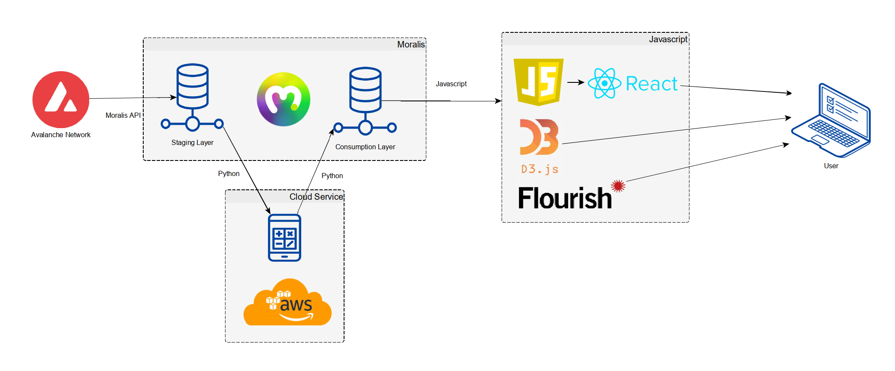

 

## System Architecture

Avalytics' system architecture is illustrated in the following figure:

According to this illustration, 
1. Source of all data is the `Avalanche C-Chain` and is read/acquired from the source through the Moralis API.
2. Data acquired from the C-Chain is stored in a Moralis database as the `Staging Layer`.
3. Through running Python programs at a `Cloud Service` (AWS, in the current implementation), the data in the staging layer is processed.
4. The data processed at the cloud service is sent back to Moralis, into a database, which serves as the `Consumption Layer`.
5. The data available at the consumption layer is queried on the frontend with Javascript, using React.js. 
6. Data queried from the consumption layer is visualized within the Avalytics app, using [D3.js](https://d3js.org/) and [Flourish Studio](https://flourish.studio/) Javascript libraries.

**Index**

1. [Background](Background.md)
2. [Unique Value Offerings](UniqueValueOfferings.md)
3. [Design Principles](DesignPrinciples.md)
4. **System Architecture**
5. [Backend: Data under Moralis](Backend.md)
6. [Frontend: UI and Visual Analytics](Frontend.md)
7. [Technology/Tool Stack](TechnologyStack.md)
8. [Related Projects](RelatedProjects.md)
9. [Other Resources](OtherResources.md)
10. [Future Plans for Avalytics](FuturePlans.md)

<hline></hline>

[Back to Main GitHub Page](../README.md) | [Back to Documentation Index Page](Documentation.md)
